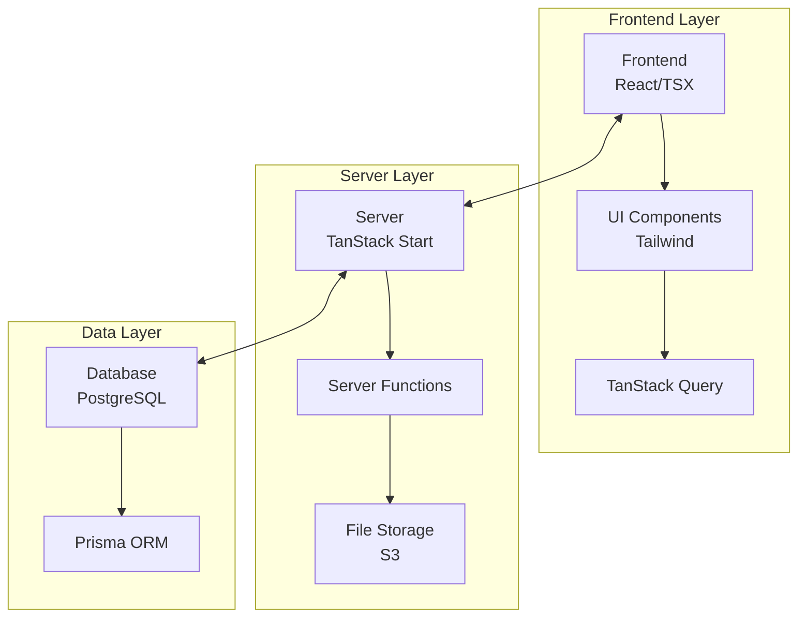
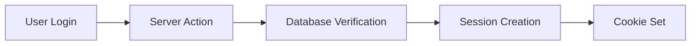
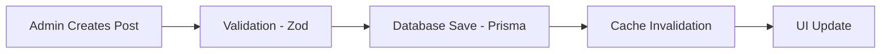
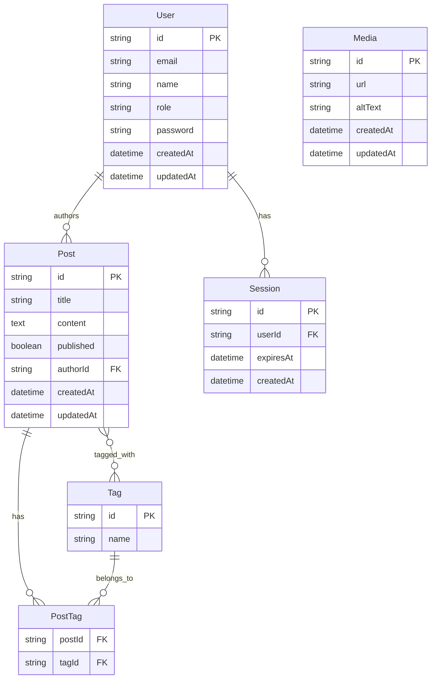
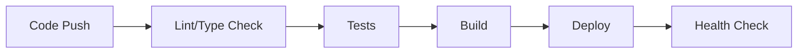
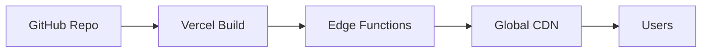
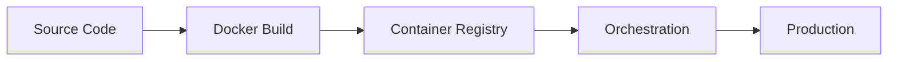

# TanCMS Architecture

This document provides a detailed overview of TanCMS architecture, design
decisions, and technical implementation.

## 🏗 High-Level Architecture

TanCMS follows a modern, full-stack React architecture with server-side
rendering:



## 🛠 Technology Stack

### Frontend Layer

- **React 19**: Latest React with concurrent features
- **TanStack Start**: Full-stack React framework with SSR
- **TanStack Router**: File-based routing with type safety
- **TanStack Query**: Server state management and caching
- **Tailwind CSS**: Utility-first CSS framework
- **TypeScript**: Static typing throughout

### Backend Layer

- **TanStack Start Server Functions**: API endpoints and server logic
- **Prisma ORM**: Type-safe database operations
- **Zod**: Runtime schema validation
- **Lucia/Auth.js**: Authentication and session management

### Data Layer

- **PostgreSQL**: Primary database (MySQL/SQLite also supported)
- **S3-Compatible Storage**: File uploads and media management
- **Redis**: Optional caching and session storage

### Infrastructure

- **Vercel**: Deployment platform (primary)
- **Docker**: Containerization support
- **GitHub Actions**: CI/CD pipeline

## 📁 Project Structure

```
tancms/
├── app/                    # Application source code
│   ├── routes/            # File-based routing
│   │   ├── index.tsx      # Homepage
│   │   ├── blog/          # Blog routes
│   │   └── admin/         # Admin dashboard
│   ├── components/        # Reusable UI components
│   │   ├── ui/           # Base UI primitives
│   │   └── forms/        # Form components
│   ├── server/           # Server-only modules
│   │   ├── db.ts         # Prisma client
│   │   ├── auth.ts       # Authentication
│   │   └── uploads.ts    # File upload handling
│   ├── lib/              # Shared utilities
│   │   ├── schema.ts     # Zod schemas
│   │   ├── utils.ts      # Helper functions
│   │   └── seo.ts        # SEO utilities
│   └── styles/           # Global styles
├── prisma/               # Database schema and migrations
├── scripts/              # Build and utility scripts
├── tests/                # Test suites
├── docs/                 # Documentation
└── public/               # Static assets
```

## 🔄 Data Flow

### Request Lifecycle

1. **Client Request**: User navigates to a page
2. **Router**: TanStack Router matches the route
3. **Loader**: Server function loads initial data
4. **SSR**: React renders on server with data
5. **Hydration**: Client takes over for interactivity
6. **Mutations**: TanStack Query handles updates

### Authentication Flow



### Content Management Flow



## 🗄 Database Design

### Entity Relationship Diagram



### Database Principles

- **Normalization**: Properly normalized to 3NF
- **Indexing**: Strategic indexes for performance
- **Constraints**: Foreign keys and unique constraints
- **Migrations**: Version-controlled schema changes

## 🔐 Security Architecture

### Authentication

- **Session-based**: Secure HTTP-only cookies
- **Password Hashing**: bcrypt with salt rounds
- **CSRF Protection**: Built-in protection mechanisms

### Authorization

- **Role-Based Access Control (RBAC)**:
  - `ADMIN`: Full system access
  - `EDITOR`: Content management
  - `AUTHOR`: Own content only
  - `VIEWER`: Read-only access

### Data Protection

- **Input Validation**: Zod schemas at API boundaries
- **SQL Injection**: Prisma ORM protection
- **XSS Prevention**: React's built-in protection
- **File Upload Security**: Type and size validation

## 🚀 Performance Considerations

### Frontend Optimization

- **Code Splitting**: Route-based lazy loading
- **Image Optimization**: Next.js Image component
- **Caching**: Browser and CDN caching strategies
- **Bundle Analysis**: Regular bundle size monitoring

### Backend Optimization

- **Database Queries**: Optimized with Prisma
- **Caching Strategy**: Redis for session/data caching
- **Connection Pooling**: Database connection management
- **CDN Integration**: Static asset delivery

### Server-Side Rendering

- **Selective SSR**: Critical content rendered server-side
- **Streaming**: Progressive page loading
- **Hydration**: Efficient client-side takeover

## 📡 API Design

### RESTful Principles

- **Resource-based URLs**: `/api/posts`, `/api/users`
- **HTTP Methods**: GET, POST, PUT, DELETE
- **Status Codes**: Proper HTTP status responses
- **Pagination**: Cursor-based for large datasets

### Type Safety

- **End-to-end Types**: Shared types between client/server
- **Runtime Validation**: Zod schemas for API inputs
- **Error Handling**: Structured error responses

## 🔧 Development Workflow

### Code Organization

- **Feature-based**: Group by domain/feature
- **Separation of Concerns**: Clear layer boundaries
- **Dependency Injection**: Testable code structure

### Testing Strategy

- **Unit Tests**: Business logic testing
- **Integration Tests**: API endpoint testing
- **E2E Tests**: User journey testing
- **Type Checking**: Compile-time error prevention

### CI/CD Pipeline



## 🌍 Deployment Architecture

### Vercel (Recommended)



### Docker Deployment



### Environment Isolation

- **Development**: Local with SQLite
- **Staging**: Vercel Preview with PostgreSQL
- **Production**: Vercel with PostgreSQL + CDN

## 🔮 Future Architecture Considerations

### Scalability

- **Microservices**: Potential service extraction
- **Event-Driven**: Webhook and event systems
- **Caching**: Advanced caching strategies
- **Database Scaling**: Read replicas and sharding

### Features

- **Real-time**: WebSocket for live updates
- **Search**: Full-text search integration
- **Analytics**: Advanced user analytics
- **Internationalization**: Multi-language support

### Technology Evolution

- **React Server Components**: Future integration
- **Edge Computing**: Enhanced edge deployment
- **AI Integration**: Content assistance features
- **Progressive Web App**: Enhanced mobile experience

## 🤝 Contributing to Architecture

When proposing architectural changes:

1. **Document Impact**: Describe system-wide effects
2. **Performance Analysis**: Benchmark changes
3. **Migration Strategy**: Plan for existing data
4. **Backward Compatibility**: Maintain API contracts
5. **Testing**: Comprehensive test coverage

## 📚 Additional Resources

- [TanStack Start Documentation](https://tanstack.com/start)
- [Prisma Best Practices](https://prisma.io/docs/guides)
- [React Performance Patterns](https://react.dev/learn)
- [Database Design Principles](https://database.guide/)
- [Web Security Guidelines](https://owasp.org/)

---

This architecture is designed to be scalable, maintainable, and
developer-friendly while providing excellent performance and user experience.
